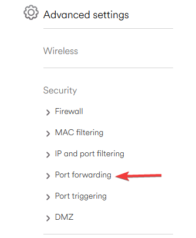
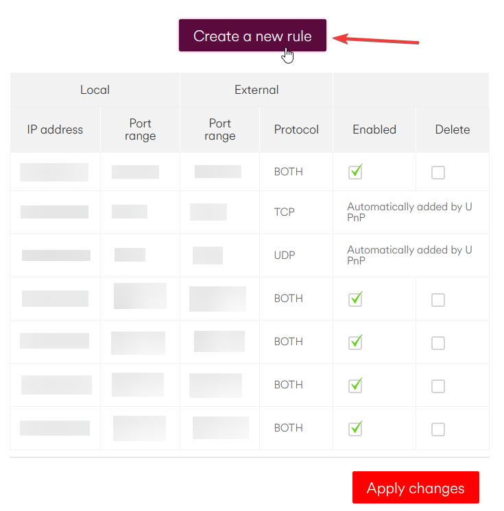
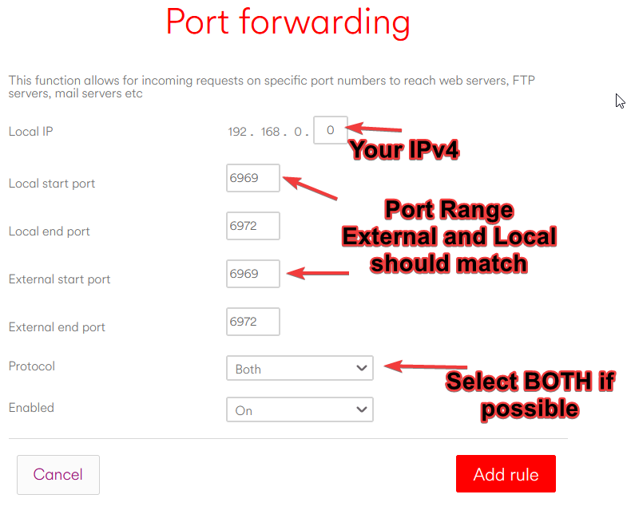

.. include:: global.rst
.. _configure:

Configuration
=============

This section is dedicated to the configuration of Stay In Tarkov. If you haven't installed Stay In Tarkov yet, click :ref:`here <install>`.

Network Configuration
---------------------

Follow this section if you're planning to be the coop game host (server). At least one person in your group needs to follow
this process to be able to play coop together. The person with the best computer and network performance should be the
host for a better experience. Don't let the lad with 10kbps internet host please.

UPnP
~~~~~~~

.. note:: 
   UPnP (Universal Plug and Play) is the **preferred** method for server hosting as it supports automagically opening 
   the ports that SIT needs while they are needed. However this only works for competent routers (looking at you USA).
   If you have issues with this please follow the guide :ref:`below <portforward>` for manually opening the required ports for |SIT|.

.. _portforward:

Port forwarding
~~~~~~~~~~~~~~~

.. note::
   Port forwarding is the process of opening a port on your external IP address and redirect the traffic to a specific 
   device. The process is different for all router models. Therefore, we cannot provide a step-by-step tutorial for 
   port forwarding.

   If you are unsure how to port forward, google "YOUR_ROUTER_MODEL port forward" or contact your Internet Service Provider.
   
   **An example has been provided below but we cannot support you on this because every router is wildly different so please try
   to find instructions for your specific router.**

Here is a quick example on how to port forward with a Virgin Media Superhub 3 (UK)

1. Open ``cmd`` and type ``ipconfig``
2. Find ``Default Gateway:`` it should have an IP similar to ``192.168.0.1``. Also note down your local IP ``IPv4 Address``
3. Open your web browser and type the ``Default Gateway`` IP into the URL bar (Not the search bar)
4. There may be a login page there, put in the login details so you can get to the main dashboard
5. You will need to look for a tab called "Port Forwarding". It may be under some advanced settings or security tab

.. raw:: html

   

      
Port Forward Setting Location

.. raw:: html

   

|brs|

6. Once in there you should be able to open certain ports to certain IPs. This is where the ``IPv4 Address`` comes in
7. Open ports 6969 to 6972, making sure to include those two as well, so 4 total ports. Some routers can port a range, if you can't you'll have to do them 1 by 1

.. raw:: html

   

      
Port Forward Screen and Set-up

.. raw:: html

   

|brs|

8. Make sure to use the "Both" option for Protocal if you can, otherwise you will need to do it twice, for both UDP and TCP
9. Once you save that those ports should now be open, and pointing traffic to your PC
10. Once you have completed these steps go :ref:`here <httpjson>` to configure the server to use these ports

.. warning::
   Not all Internet Service Provider allows port forwarding. Sometimes port forwarding is blocked at the provider level or
   at the router level. In any case, the person able to port forward should be the host, provided their computer and network 
   is capable.

   If that is the case, you may have to use a VPN (Virtual Private Network) like Hamachi, Radmin or ZeroTier to allow people to connect
   however these may come with performance hits to players ping due to how they work. Port fowarding is the prefered method.

Virtual Private Network (VPN)
~~~~~~~~~~~~~~~~~~~~~~~~~~~~~

.. note::
   Virtual private network such as Hamachi, Radmin or ZeroTier allows to create an internet-based "local" network. All traffic 
   will be transmitted through the internet and redirected to a virtual network adapter which acts as a local network. This is 
   useful for those which are unable to port forward. However, performance is not as good as port forwarding because 
   traffic must go through a third party service.

   If you need help setting these up a basic guide will be provided however we cannot help with issues coming from using these,
   so it may be best to look up a guide on how to use them beforehand.

.. warning::
   We do not recommend using VPN to play Stay In Tarkov because they are known to have rate limitations and hinder network
   performance and stability. SIT is not well optimized and transmit a lot of data to synchronize information between players.
   
   **Use at your own risk.**
.. raw:: html

   

      
Hamachi Configuration

#. Install hamachi from their offical site here `Hamachi <https://vpn.net/>`_
#. Click the ppower button, it should ask you to log in, either log in or register an account to continue
#. Now if you are joining a friend, press "Join an Existing Network" and enter the ID and password, if you are hosting, create a network
#. Once you are all in the network, make sure everyones light is green, if not, look up a guide to fix it, we **CANNOT** help with this.
#. If everyone is connected and with green light, go :ref:`here<httpjson>` to setup the server to use the VPN

.. raw:: html

   

|brs|

.. raw:: html

   

      
Radmin Configuration

#. PLACEHOLDER

.. raw:: html

   

|brs|

.. _httpjson:

HTTP JSON file configuration
~~~~~~~~~~~~~~~~~~~~~~~~~~~~

#. Open ``SIT/Server/Aki_Data/Server/configs/http.json`` with your preferred text text editor.
#. Locate the "ip" parameter. You should see a default value of "127.0.0.1".
#. Change "127.0.0.1" with ``0.0.0.0``. (Only change from ``0.0.0.0`` if you know what you're doing)
#. Save your changes and close the text editor.

General configuration
---------------------