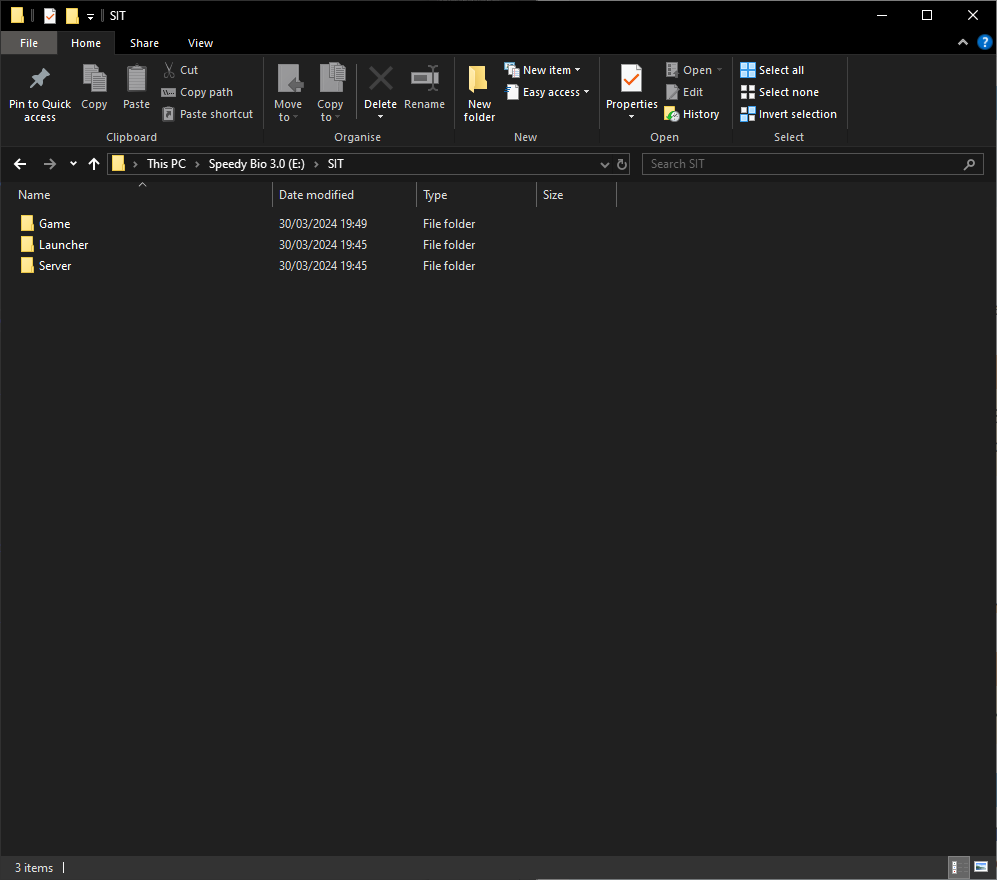
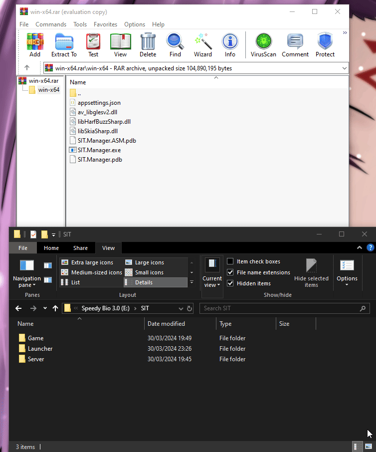
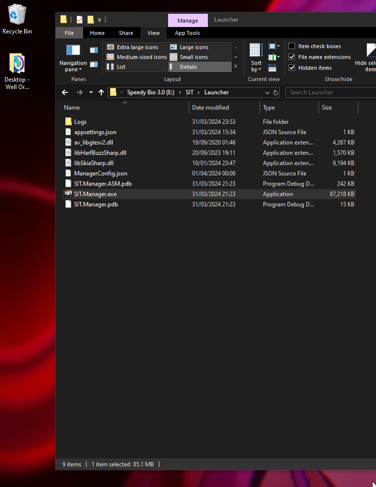
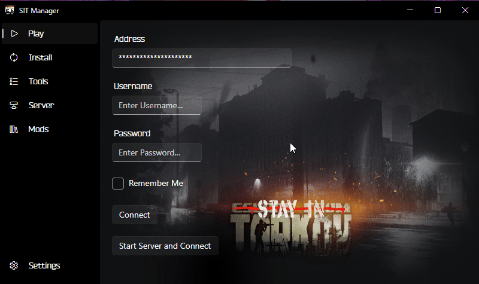

.. include:: global.rst
.. _install:

Installation
============

This section is dedicated for a new installation of |SIT|. If you're looking to update SIT, click here.

Getting started
---------------

|EFT| requirements
~~~~~~~~~~~~~~~~~~

* You need a legally purchased copy of |EFT|, `obtainable here <https://www.escapefromtarkov.com/preorder-page>`_.
* You need to install the game using the official game launcher.
* You need to run the game at least once using the official game launcher.

.. warning::
   * **DON'T** move your original EFT game folder following the installation.
   * **DON'T** change any of the files in your original EFT game folder.
   * **DON'T** install SIT in your original EFT game folder. **YOU HAVE BEEN WARNED!**
   * **ALWAYS** make sure you are able to run the game using the official game launcher before using SIT.
   * **DON'T** take shortcuts. Follow this step by step. If you haven't, you will be **MOCKED**

.. _filestruct:

Preparing the folder structure
~~~~~~~~~~~~~~~~~~~~~~~~~~~~~~

Create the following folder structure on the drive of your choice, as long as it has enough space for |EFT|. The drive should have at least ``60GB`` free space.

.. code-block:: none
   
   SIT/
   ├── Game/
   ├── Server/
   └── Launcher/
.. raw:: html

   

      
Example directory layout

.. raw:: html

   

|brs|

.. note::
   It is recommended to use this folder structure for a SIT installation. Note that the rest of the documentation will refer to 
   that structure.

   Below is the steps to install the SIT Manager, which as of version ``2.0.8856.37884`` can automagically copy your Live |EFT| folder
   into a folder of your choice **REMEBER THE** :ref:`FILE STRUCTURE<filestruct>`

Installing |SITM|
-----------------

.. note:: 
   It is **HIGHLY** recommended to use the |SITM| to install |SIT| as it **HIGHLY** simplifies
   the process and is almost completley automatic. It also provides us with valuble log files, :strike:`they taste great`,
   they help us solve issues you may encounter as well. Manual intall intructions are provided but should be **AVOIDED**
   wherever possible

1. Download the latest |SITM| from `Github <https://github.com/stayintarkov/SIT.Manager.Avalonia/releases/tag/2.0.8856.37884>`_
2. Extract the files from the ``.zip`` into |LDIR|

.. raw:: html

   

      
Manager Installation

.. raw:: html

   

|brs|

3. For sake of convinience, you can make a Shortcut to the manager on your desktop, since you need this **EVERY** time you join a server

.. raw:: html

   

      
Making Shortcut

.. raw:: html

   

|brs|

4. Now open the manager and Navigate to "Install" page
5. Press "Install SIT"
6. Select the latest version (Should be Auto-Selected)
7. Press "Change" on EFT Install path, which right now is pointing to your **LIVE** install, and change it to |GDIR|
8. Press "Start Install"
9. Wait a bit for the Manager to copy your game files and install the SIT mod
10. Once this is complete, SIT has been successfully installed to your client. Head to :ref:`Finishing up<finishingup>` to finish the install process, or to :ref:`Server Install<serverinst>` if you plan on hosting a server

.. raw:: html

   

      
Installing SIT

.. image:: images/EFTManagerInstall.apng
   :width: 800

.. raw:: html

   

|brs|

.. _serverinst:

Installing |SIT| Server
~~~~~~~~~~~~~~~~~~~~~~~

.. note:: 
   Make sure the person installing the server, if they are installing it on their local machine, is
   the one with the most powerful PC and best Network otherwise performance may be Sub-optimal.

   This applies to both hosting the AKI server, and Hosting the raid, more on that later in the guide.

1. Open the |SITM|
2. Go to "Install"
3. Click "Install Server + SIT Mod"
4. Change the path to your |SDIR| path
5. Click "Start Install"
6. Once that completes, Navigate to "Server"
7. Start the server and wait for the "Server started!" message
8. Stop the server, this allows it to generate all relevant configs
9. Once you have done that, head over to :ref:`Finishing Up<finishingup>` to continue

.. raw:: html

   

      
Installing SIT Server

.. raw:: html

   

|brs|

.. _finishingup:

Finishing Up
~~~~~~~~~~~~

Once you have completed installation, if you plan to join other players, head :ref:`here<clientinst>`, if you want to host then head :ref:`here<netconfigure>`.

Installing manually
~~~~~~~~~~~~~~~~~~~

.. warning::
   * It is **strongly** recommended to use |SITM| to install |SIT|.
   * Even if |SIT| is manually installed, you will still need to use the |SITM| to connect to servers so this should only be done as a last resort.

#. **COPY** your Live |EFT| files into the |GDir| folder
#. Download `BepInEx <https://github.com/BepInEx/BepInEx/releases/download/v5.4.22/BepInEx_x64_5.4.22.0.zip>`_.
#. Extract BepInEx to your ``\SIT\Game\`` folder.
#. Create a new folder at the path ``\SIT\Game\BepInEx\`` called ``plugins``.
#. Download the latest `Stay In Tarkov release <https://github.com/stayintarkov/StayInTarkov.Client/releases/latest>`_.
#. Extract the ``StayInTarkov.dll`` file to your ``\SIT\Game\BepInEx/plugins`` folder.
#. Extract the ``Assembly-CSharp.dll`` file to ``\SIT\Game\EscapeFromTarkov_Data\Managed`` and replace the file when prompted.
